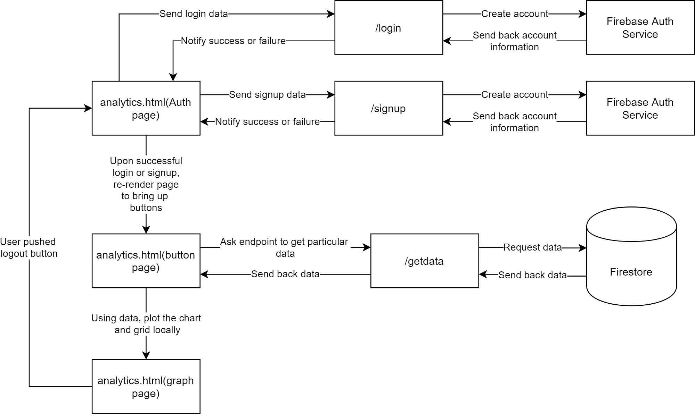
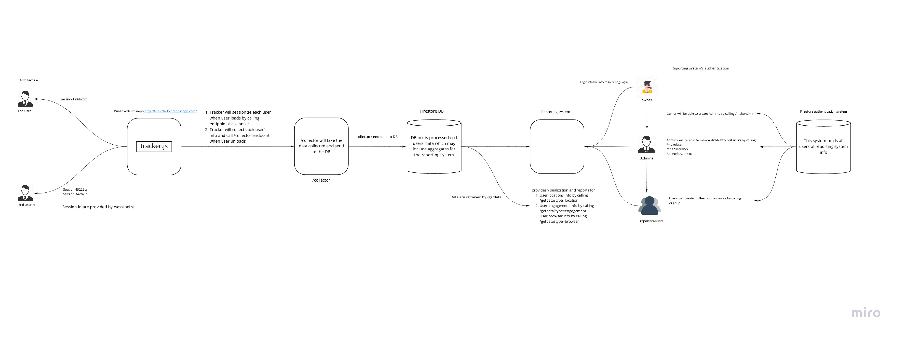

= acewebtool

The goal of this project is to implement a web analytics tool that helps enables users anlysis their websites

== Technologies used
* https://firebase.google.com/docs/functions [`Firebase REST API and cloud functions`] for automatically run backend code in response to events triggered by Firebase features and HTTPS requests. 
* http://vanilla-js.com/ [`Vanilla Js`] for as the lightweight framework for fast DOM manipulation and code execution

== Project Architecture
=== Endpoint Structure

=== App Structure

